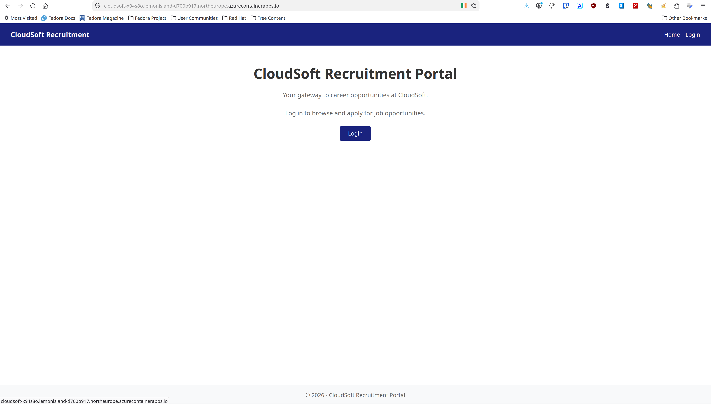

# Report
# "Inlämningsuppgift 1: Containerbaserad webbapplikation — från inner loop till Azure Container Apps"

**Author:** Claes Fransson  
**Date:** May 20, 2026  
**Repository:** https://github.com/Claes1981/inlamningsuppgift1



---

## 1. Introduction

This is a report for the first assignment of the Cloud Developer course ("Molnapplikationer Fördjupning"). The assignment requires building a containerized .NET MVC web application (CloudSoft Recruitment Portal) and deploying it to Azure Container Apps with CI/CD.

The CloudSoft Recruitment Portal is a web application that allows candidates to browse published job postings and administrators to create, edit, publish, and close job postings. The application uses Azure CosmosDB as its data store and implements role-based access control with two user roles: Administrator and Candidate.

The application is deployed and accessible at: `https://cloudsoft-26139111825.happyforest-16e6cec2.northeurope.azurecontainerapps.io`

---

## 2. Agile Working Method and Inner Loop ("Delmoment 1")

### 2.1 User Stories

Three user stories have been created and documented in `doc/user_stories/`:

**US-1: Browse Job Postings**
- As a candidate, I want to browse available job postings so that I can find opportunities that match my skills and interests.
- Acceptance criteria: landing page displays published job postings with title, location, and description; clicking a listing navigates to a detail page.
- **Status:** Implemented — `HomeController.Index` returns published job postings via `JobPostingService.GetPublishedAsync()`.

**US-2: Apply for Job**
- As a candidate, I want to apply for a job posting so that I can express my interest in a position.
- Acceptance criteria: application form with name and cover letter, persisted to database, confirmation to candidate, duplicate prevention.
- **Status:** The `JobApplication` entity is defined in the Domain layer with validation, but the apply functionality is **not implemented** in the UI or service layer. This is a known gap — see §10 (Scope Boundary).

**US-3: Manage Job Postings**
- As an administrator, I want to create, edit, publish, and close job postings so that I can manage the recruitment process.
- Acceptance criteria: CRUD operations, role-based access control, status transitions.
- **Status:** Implemented — `JobPostingsController` with full CRUD, publish, and close operations, protected by `[Authorize(Roles = Constants.AdministratorRole)]`.

### 2.2 Inner Loop Description

The inner loop (development cycle) mainly followed this workflow:

1. **Edit**: Use the Pi Coding Agent or Opencode harness with Llama.cpp (llama-server) with Qwen3.6-27B to implement changes. The agent has access to the assignment description and online course exercises.
2. **Build**: Run `dotnet build src/CloudSoft.Web/CloudSoft.Web.csproj` to verify compilation. Note: the solution uses `CloudSoft.slnx` (VS2022 v2 format) — there is no `.sln` file.
3. **Test**: Run `dotnet run --project src/CloudSoft.Web/CloudSoft.Web.csproj` to test locally. This requires a CosmosDB connection string configured via user secrets (`UserSecretsId=cloudsoft-web-dev`).
4. **Containerize**: Run `podman compose up --build` to test the full stack (webapp + CosmosDB emulator) in containers.

When the application depends on CosmosDB, the inner loop requires either a local CosmosDB emulator (via docker-compose) or a remote CosmosDB account. The emulator uses a self-signed certificate, which requires special handling in the .NET SDK (see §4.4).

---

## 3. Containerization and Local Development Environment ("Delmoment 2")

### 3.1 Dockerfile

A multi-stage Dockerfile with three stages:

**Stage 1 — Build** (`mcr.microsoft.com/dotnet/sdk:10.0`):
- Copies `CloudSoft.slnx` and `src/` directory
- Runs `dotnet restore CloudSoft.Web/CloudSoft.Web.csproj`
- Runs `dotnet build` in Release configuration

**Stage 2 — Publish** (inherits from build):
- Runs `dotnet publish` with `/p:UseAppHost=false` for a framework-dependent deployment

**Stage 3 — Runtime** (`mcr.microsoft.com/dotnet/aspnet:10.0`):
- Copies published output from the publish stage
- Exposes port 8080 with `ASPNETCORE_HTTP_PORTS=8080`
- Entry point: `dotnet CloudSoft.Web.dll`

Key design decisions:
- The `aspnet:10.0` image is a **chiseled** (minimal) image — it does not include `curl`, `adduser`, or other common utilities. Therefore, no `HEALTHCHECK` instruction and no non-root user are included.
- Dependency restore happens inside the SDK container to ensure reproducible builds regardless of the host environment.
- The `.dockerignore` file excludes `**/bin/`, `**/obj/`, `doc/`, `*.md` (except `AGENTS.md`), and other unnecessary files from the build context.

### 3.2 Docker Compose

A `docker-compose.yml` file orchestrates two services:

**webapp service:**
- Builds from the local Dockerfile
- Maps port 8080
- Configures environment variables for CosmosDB connection (uses the emulator's default key)
- Depends on the cosmosdb service with `condition: service_healthy`

**cosmosdb service:**
- Uses `mcr.microsoft.com/cosmosdb/linux/azure-cosmos-emulator:latest`
- Maps port 8081
- Sets `EMS_ENABLE_ENDPOINT_VALIDATION=false` to disable endpoint validation
- Health check uses `curl -fk` (follow redirects, ignore certificate) to check `/_explorer/index.html`
- 60-second start period, 10-second interval, 10 retries
- 3GB memory limit

### 3.3 Container Registry

The container image is pushed to **Docker Hub** (`claes1981/cloudsoft-recruitment`) during the CI/CD pipeline. The image is tagged with both the git commit SHA and `latest`. Docker Hub was chosen over Azure Container Registry (ACR) for simplicity — the course exercises reference Docker Hub as a valid option, and it avoids the additional Azure resource and managed identity configuration that ACR would require.

---

## 4. Authentication, Authorization, and Data Layer ("Delmoment 3")

### 4.1 Authentication

The application uses **ASP.NET Core Identity** for authentication, not hardcoded cookie-based auth. The Identity system is configured through the `IdentityExtensions.AddCloudSoftIdentity` extension method:

- **User management**: `SignInManager<ApplicationUser>` handles login, logout, and password validation
- **User store**: InMemory by default (`IdentityStore:Provider=inmemory`), switchable to SQLite via configuration (`IdentityStore:Provider=sqlite`) — useful for local development persistence
- **Password policy**: Minimum 6 characters, requires digit, no uppercase/lowercase/special character requirements (kept simple for assignment scope)
- **Login flow**: `AccountController` provides `Login` (GET/POST), `Logout` (POST), and `AccessDenied` pages
- **CSRF protection**: All POST actions are decorated with `[ValidateAntiForgeryToken]`

### 4.2 Authorization

Role-based authorization with two roles defined in `CloudSoft.Domain.Constants`:

| Role | Constant | Access |
|---|---|---|
| Administrator | `Constants.AdministratorRole` ("Administrator") | Full access to job posting management |
| Candidate | `Constants.CandidateRole` ("Candidate") | Browse published job postings |

- `JobPostingsController` is decorated with `[Authorize(Roles = Constants.AdministratorRole)]` — only administrators can create, edit, publish, close, or delete job postings
- `HomeController` allows anonymous access — anyone can browse published job postings
- `HealthController` is publicly accessible for health checks

### 4.3 Admin Seeding

The first administrator is created automatically at application startup through `IdentitySeeder.SeedAsync()`, called from `Program.cs`:

- Roles (`Administrator`, `Candidate`) are created idempotently — the seeder checks if they exist before creating
- Admin user is created with credentials from configuration:
  - `AdminSeed:Username` (default: `admin`)
  - `AdminSeed:Password` (default: `Admin123!`)
  - `AdminSeed:Email` (default: `admin@cloudsoft.com`)
- The seeder is idempotent — it skips creation if the admin user already exists
- In production, these credentials should be provided via environment variables, not defaults. Therefore the currently deployed app should only be seen as a demonstration app.

### 4.4 Cookie Security

Cookie authentication is configured with security-appropriate settings per environment:

- `HttpOnly = true` — cookies are not accessible via JavaScript (prevents XSS theft)
- `SecurePolicy` — `None` in Development (allows HTTP), `Always` in Production (HTTPS only)
- `SameSite = Strict` — prevents cookies from being sent in cross-site requests (CSRF mitigation). Note: `SameSiteMode.Strict` is used instead of the deprecated `SameSite.Lax` in .NET 10.
- HSTS is enabled in production via `app.UseHsts()`

### 4.5 Data Layer — CosmosDB Repository

A generic repository pattern with four layers:

**Domain Layer** (`CloudSoft.Domain`):
- `JobPosting` entity: `Id`, `PartitionKey`, `Title`, `Location`, `Description`, `Status`, `IsActive`, `CreatedAt`, `UpdatedAt` — includes `IsValid()` validation method
- `JobApplication` entity: `Id`, `PartitionKey`, `JobPostingId`, `CandidateName`, `CoverLetter`, `Status`, `AppliedAt` — includes `IsValid()` validation
- `JobPostingStatus` enum: `Draft`, `Published`, `Closed`
- `ApplicationStatus` enum: `Pending`, `Accepted`, `Rejected`
- `IRepository<T>` interface: `GetByIdAsync`, `GetAllAsync`, `AddAsync`, `UpdateAsync`, `DeleteAsync`
- `Constants` class: centralized constants for `PartitionKey` (`/PartitionKey`), `DefaultDatabaseName` (`CloudSoft`), `DefaultContainerName` (`JobPostings`), and role names

**Data Layer** (`CloudSoft.Data`):
- `CosmosRepository<T>` implements `IRepository<T>` using the Azure Cosmos SDK v3.59.0
- Uses SQL API with `QueryDefinition` for queries
- `ApplicationDbContext` extends `IdentityDbContext<ApplicationUser>` for Identity storage (InMemory or SQLite)
- `ApplicationUser` extends `IdentityUser` with no custom properties

**Services Layer** (`CloudSoft.Services`):
- `IJobPostingService` / `JobPostingService`: business logic with `GetAllAsync`, `GetPublishedAsync` (filters by `Published` status AND `IsActive`), `GetByIdAsync`, `CreateAsync`, `UpdateAsync`, `DeleteAsync`, `PublishAsync`, `CloseAsync`
- Validation is enforced in `CreateAsync` and `UpdateAsync` via `JobPosting.IsValid()`

**Dependency Injection** (configured via extension methods):
- `CosmosClient` — singleton (registered in `CosmosExtensions.AddCosmosDb`)
- `IRepository<JobPosting>` — singleton (factory in `CosmosExtensions.AddCosmosDb`)
- `IJobPostingService` — scoped (registered in `Program.cs`)
- `ApplicationDbContext` — scoped (registered in `IdentityExtensions.AddCloudSoftIdentity`)

### 4.6 Local vs. Production Data

| Component | Local Development | Production |
|---|---|---|
| CosmosDB | Emulator via docker-compose (port 8081, self-signed cert) | Azure CosmosDB for NoSQL (autoscale, 1000 RU) |
| Identity Store | EF Core InMemory (default) | EF Core InMemory (same — stateless, seeded at startup) |
| Connection | User secrets or `.env` | Container Apps secret → env var |

---

## 5. CI/CD Pipeline and Azure Deployment ("Delmoment 4")

### 5.1 Pipeline Structure

The CI/CD pipeline is a GitHub Actions workflow (`.github/workflows/ci-cd.yml`) with two jobs:

**Job 1: `build-and-push`**
- Runs on `ubuntu-latest`
- Checks out the repository
- Logs into Docker Hub using `docker/login-action@v3` with `DOCKERHUB_USERNAME` and `DOCKERHUB_TOKEN` secrets
- Builds and pushes the Docker image using `docker/build-push-action@v5`
- Tags: `claes1981/cloudsoft-recruitment:<sha>` and `claes1981/cloudsoft-recruitment:latest`

**Job 2: `deploy`**
- Depends on `build-and-push` completing successfully
- Logs into Azure using `azure/login@v2` with `AZURE_CREDENTIALS` secret (service principal JSON)
- Creates the resource group `cloudsoft-rg` (idempotent — existing group is reused)
- Deploys the Bicep infrastructure template with parameters:
  - `uniqueSuffix`: GitHub run ID for resource name uniqueness
  - `dockerHubUsername`: from `DOCKERHUB_USERNAME` secret
  - `containerImage`: SHA-tagged image from the build job
- Verifies deployment by querying the Bicep output for the app FQDN

### 5.2 Trigger Strategy

The pipeline triggers on:
- Push to `main` branch (automatic deployment on every push)
- Manual `workflow_dispatch` (for re-deployments without code changes)

### 5.3 Secrets Management

No secrets are committed to the repository. The following GitHub Actions secrets are configured:

| Secret | Purpose |
|---|---|
| `DOCKERHUB_USERNAME` | Docker Hub account name (`claes1981`) |
| `DOCKERHUB_TOKEN` | Docker Hub Personal Access Token (read + write permissions) |
| `AZURE_CREDENTIALS` | Service principal JSON with `clientId`, `clientSecret`, `subscriptionId`, `tenantId` |

The service principal has **Contributor** role scoped to the `cloudsoft-rg` resource group only — it cannot access other resources in the subscription.

The CosmosDB connection string is constructed dynamically in Bicep using `cosmosAccount.listKeys().primaryMasterKey` and stored as a Container Apps secret referenced via `secretRef` — never exposed as plain text in environment variables.

---

## 6. Infrastructure as Code — Bicep

### 6.1 Resource Provisioning

The Bicep template (`infra/main.bicep`) provisions the following Azure resources:

**Azure CosmosDB for NoSQL:**
- Account with SQL API, `Session` consistency level, deployed to `northeurope`
- Database `CloudSoft` with container `JobPostings`
- Partition key: `/PartitionKey` (Hash distribution)
- Autoscale throughput with 1000 RU max

**Azure Container Apps Environment:**
- Managed environment for hosting the container app
- Logs configured to send to Azure Monitor

**Azure Container App:**
- Runs `claes1981/cloudsoft-recruitment:<sha>` image
- Ingress: external, HTTPS only (`allowInsecure: false`), target port 8080
- Scaling: 1-3 replicas (auto-scale enabled)
- Resources: 0.5 CPU, 1 GiB memory per replica
- Environment variables:
  - `ASPNETCORE_ENVIRONMENT=Production`
  - `ConnectionStrings__CosmosDb` (from Container Apps secret via `secretRef`)
  - `CosmosDb__DatabaseName` and `CosmosDb__ContainerName`

### 6.2 Parameterization

| Parameter | Default | Source |
|---|---|---|
| `uniqueSuffix` | (required) | `github.run_id` from GitHub Actions |
| `dockerHubUsername` | (required) | `DOCKERHUB_USERNAME` secret |
| `containerImage` | `<username>/cloudsoft-recruitment:latest` | Built image with SHA tag |
| `location` | `northeurope` | Hardcoded default |
| `appName` | `cloudsoft` | Hardcoded default |
| `containerMinReplicas` | `1` | Hardcoded default |
| `containerMaxReplicas` | `3` | Hardcoded default |

### 6.3 Outputs

- `appUrl` — FQDN of the deployed Container App
- `cosmosEndpoint` — CosmosDB account endpoint URL

### 6.4 Known Bicep Warnings

The Bicep template produces three linter warnings during deployment:

1. **`use-parent-property`** (line 31): `cosmosDatabase` name uses `${parent}/${child}` format instead of the `parent` property. This is a style warning — the template works correctly.
2. **`use-parent-property`** (line 41): Same issue for `cosmosContainer`.
3. **`BCP036`** (line 116): `cpu` property expects `int | null` but receives `'0.5'` (string). The Bicep type definition expects an integer, but the Container Apps API accepts decimal CPU values as strings. This is a known type definition inaccuracy in the Bicep types — the deployment succeeds despite the warning.

These warnings do not affect deployment or runtime behavior.

### 6.5 Reproducibility

The environment can be recreated manually with:
```bash
az group create --name cloudsoft-rg --location northeurope
az deployment group create \
  --resource-group cloudsoft-rg \
  --template-file infra/main.bicep \
  --parameters uniqueSuffix=<suffix> dockerHubUsername=<username> containerImage=<image>
```
All infrastructure is defined as code — no manual Azure portal steps are required.

---

## 7. Verification of Deployed Solution ("Delmoment 5")

### 7.1 Deployment Status

The latest deployment (GitHub Actions run) completed successfully:
- **FQDN**: `cloudsoft-26139111825.happyforest-16e6cec2.northeurope.azurecontainerapps.io`
- **Resource Group**: `cloudsoft-rg` in `northeurope`
- **CosmosDB Account**: `cosmoscloudsoft26139111825`
- **Container App**: `cloudsoft-26139111825`
- **Provisioning State**: `Succeeded`
- **Image**: `claes1981/cloudsoft-recruitment:ab57297ecfde6421f331dac0e2f1a42f47636774`

### 7.2 Health Check

The `/health` endpoint returns HTTP 200 with a JSON response containing a UTC timestamp.

### 7.3 Functional Verification

- Application is accessible via public internet through the Container Apps endpoint
- Login works with seeded admin credentials
- Role-based access control is enforced — `JobPostingsController` requires `Administrator` role
- CosmosDB is provisioned and accessible — the application auto-creates database and container on startup via `EnsureCosmosDbAsync()`
- CRUD operations for job postings function through the admin interface (Create, Read, Update, Delete, Publish, Close)

---

## 8. Security Considerations

### 8.1 Application Security
- ASP.NET Core Identity with password validation policy
- Cookie flags: `HttpOnly = true`, `SecurePolicy.Always` in production
- `SameSiteMode.Strict` for CSRF mitigation
- `[ValidateAntiForgeryToken]` on all POST actions
- `[Authorize(Roles = "Administrator")]` on admin controller
- HTTPS redirection via `UseHttpsRedirection()`
- HSTS enabled in production via `UseHsts()`

### 8.2 Deployment Security
- **Container Apps secrets**: CosmosDB connection string stored as secret, referenced via `secretRef` — never in plain text env vars
- **HTTPS only**: `allowInsecure: false` on Container Apps ingress
- **GitHub Actions secrets**: Docker Hub credentials and Azure service principal stored as encrypted secrets
- **Service principal scoping**: Contributor role limited to `cloudsoft-rg` only
- **Bicep dynamic keys**: CosmosDB keys retrieved at deploy time via `listKeys()` — no hardcoded connection strings

### 8.3 Known Limitations
- Docker Hub is a public registry — images are pullable without authentication. For production, ACR with private access and managed identity would be preferred.
- No managed identity for CosmosDB — connection string authentication works but doesn't follow zero-trust principles.
- CORS and rate limiting are not configured.
- The `docker-compose.yml` contains the CosmosDB emulator's default account key in plain text — this is only for local development and is gitignored via `.gitignore` patterns where applicable.

---

## 9. AI Assistant Usage

Throughout this assignment, AI coding assistants (Pi Coding Agent / Opencode with Llama.cpp and Qwen3.6-27B) have been used extensively:

- **Project scaffolding**: Generated the four-layer architecture (Domain → Data → Services → Web) with proper project references
- **Dockerfile and docker-compose**: Created multi-stage Dockerfile and compose configuration for local development
- **CosmosDB integration**: Implemented the generic repository pattern and `CosmosExtensions` for DI registration
- **ASP.NET Core Identity**: Configured Identity with extension method pattern, seed logic, and cookie settings
- **Bicep and CI/CD**: Wrote the infrastructure template and GitHub Actions workflow
- **Debugging**: Resolved issues with chiseled image limitations, CosmosDB emulator certificate handling, and Azure service principal authentication
- **Documentation**: Assisted with writing this report

Much of the AI-generated code was reviewed, tested, and adapted by the developer. The AI suggested hardcoding credentials for simplicity, which was rejected in favor of proper secret management (user secrets, GitHub Actions secrets, Container Apps secrets).

---

## 10. Scope Boundary ("Avgränsning")

This assignment demonstrates the skills covered in the course exercises without introducing advanced patterns beyond the curriculum.

**Included:**
- .NET 10.0 MVC application with multi-layer architecture (Domain → Data → Services → Web)
- ASP.NET Core Identity with two roles (Administrator, Candidate) and automatic admin seeding
- Azure CosmosDB with generic repository pattern
- Multi-stage Dockerfile and docker-compose for local development
- GitHub Actions CI/CD pipeline with Docker Hub as registry
- Bicep Infrastructure as Code for Azure resource provisioning
- Azure Container Apps for production hosting
- Health endpoint for deployment verification

**Excluded (with justification):**
- **Job Application UI (US-2)**: The `JobApplication` entity is defined but the apply functionality is not implemented in the UI. The assignment focuses on the deployment pipeline, and the job posting CRUD flow demonstrates the full stack sufficiently.
- **Azure Container Registry (ACR)**: Docker Hub was chosen for simplicity. ACR would add an extra resource and managed identity configuration.
- **Managed Identity for CosmosDB**: Connection string authentication aligns with course lab patterns. Managed identity would require role-based access control on CosmosDB.
- **Unit/Integration Tests**: The `tests/` directory is empty. The assignment focuses on the deployment pipeline rather than test infrastructure.
- **Azure Key Vault**: Secrets are managed via GitHub Actions secrets and Container Apps secrets, matching the course exercise pattern.

---

## 11. Summary of Completed Work

| Deliverable | Status | Notes |
|---|---|---|
| User stories (Delmoment 1) | ✅ Complete | 3 user stories documented in `doc/user_stories/` |
| Inner loop description (Delmoment 1) | ✅ Complete | Edit-build-test-containerize cycle |
| Dockerfile (Delmoment 2) | ✅ Complete | Multi-stage build, tested with podman |
| docker-compose.yml (Delmoment 2) | ✅ Complete | Webapp + CosmosDB emulator |
| Authentication (Delmoment 3) | ✅ Complete | ASP.NET Core Identity, two roles, admin seeding |
| Authorization (Delmoment 3) | ✅ Complete | Role-based with `[Authorize]` |
| CosmosDB repository (Delmoment 3) | ✅ Complete | Generic repository pattern |
| CI/CD pipeline (Delmoment 4) | ✅ Complete | GitHub Actions, Docker Hub, Bicep deploy |
| Bicep IaC (Delmoment 4) | ✅ Complete | CosmosDB + Container Apps provisioned |
| Azure deployment (Delmoment 4) | ✅ Complete | Running in northeurope |
| Verification (Delmoment 5) | ✅ Complete | Health check 200, app accessible |
| Job Application UI (US-2) | ⏳ Not implemented | Entity defined, UI/service layer pending |

---

## 12. Conclusion

All five deliverables of the assignment have been completed. The CloudSoft Recruitment Portal is a fully containerized .NET MVC web application deployed to Azure Container Apps with an automated CI/CD pipeline. The application demonstrates:

- **Clean architecture**: Four-layer separation (Domain → Data → Services → Web) with dependency injection
- **Containerization**: Multi-stage Dockerfile optimized for minimal image size, with docker-compose for local development
- **Authentication and authorization**: ASP.NET Core Identity with role-based access control and automatic admin seeding
- **Cloud data persistence**: Azure CosmosDB with generic repository pattern
- **Automated deployment**: GitHub Actions pipeline building Docker images and deploying via Bicep IaC
- **Infrastructure as Code**: All Azure resources provisioned through Bicep templates — no manual portal steps required

The application is live at `https://cloudsoft-26139111825.happyforest-16e6cec2.northeurope.azurecontainerapps.io` and accessible from the public internet.
